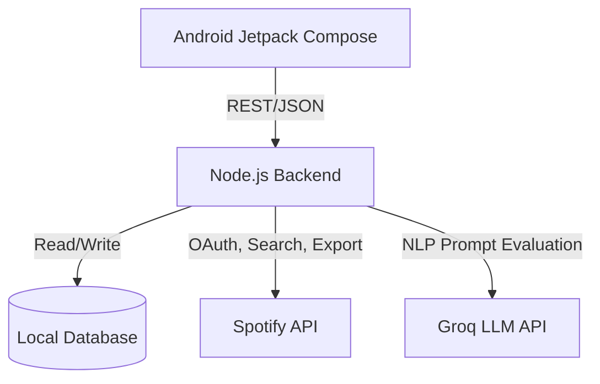
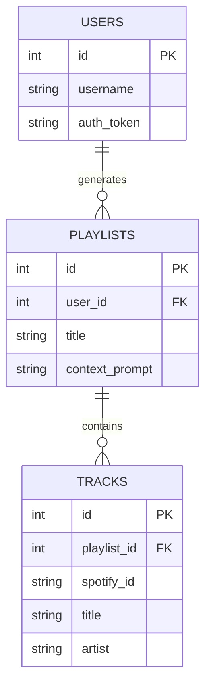

# Project Report: Music Playlist Generation App

## System Requirements
- **Frontend Client:** Android application built with Kotlin and Jetpack Compose.
- **Backend Architecture:** Node.js Express server.
- **Database:** Relational Database (structured via SQL migrations).
- **External Integrations:** Spotify Web API (music catalog & export) and Groq API (LLM for natural language processing).

## Use Cases
- **User Authentication:** Secure login mapping to saved preferences.
- **Prompt Input:** Users describe a mood, activity, or genre context for playlist generation.
- **AI Recommendation:** The backend parses the prompt via Groq LLMs to determine song characteristics and queries Spotify.
- **Playlist Export:** Users preview the generated selection and export the final list to their personal Spotify library.

## Component Architecture

## Database Model

